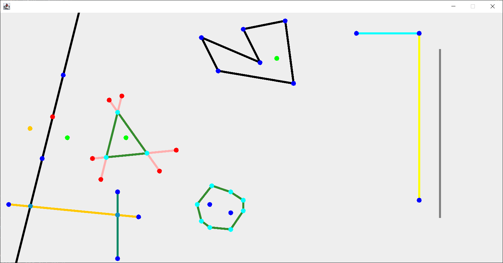
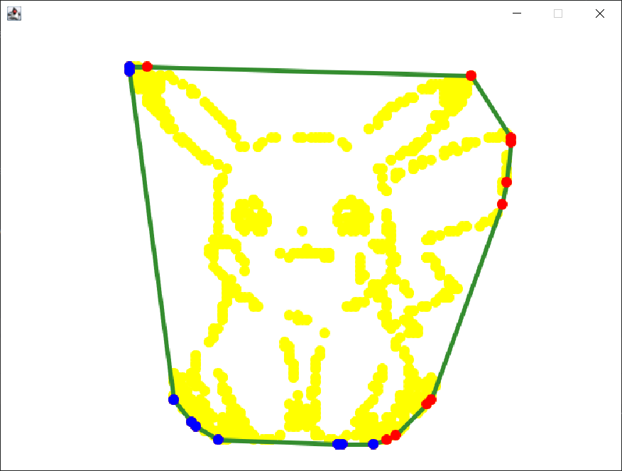
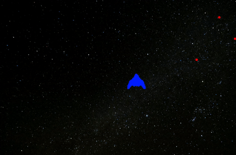
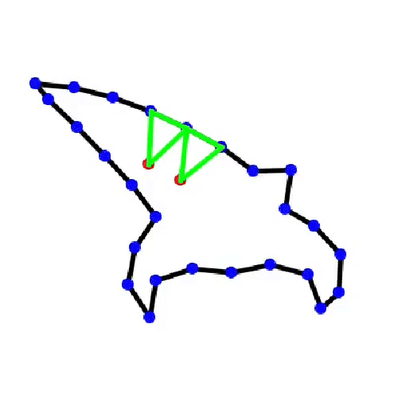
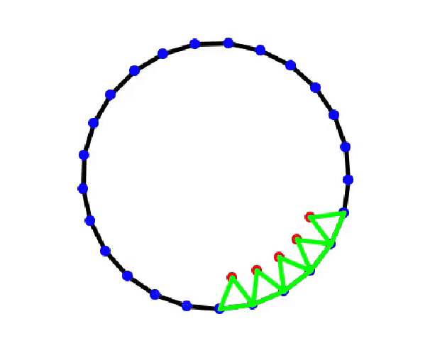
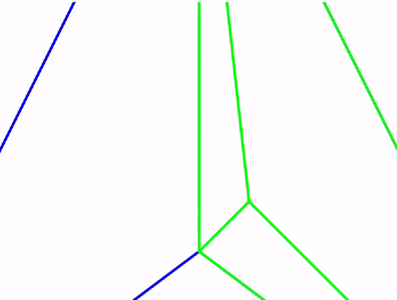
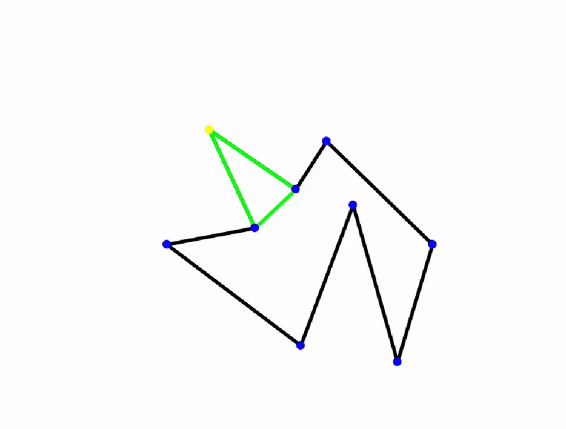

# Overview
This repository consists of projects for 'Computational Geometry', which I had during my fourth semester at AGH University of Cracow.
All of the software has been created with usage of IntelliJ IDEA in Java language.

A big part of this repository is a display system made using wing Java library. The system was written from ground up by me and has significantly changed overtime to fulfil the needs of respective projects. 
The system can visualize geometrical shapes, draw them in a specific color and later even visualize their movement. 

Comprehensive descriptions of specific projects are below.

# CG.1 - 2D Space
The project is separated into three windows, which consists of different exercises. Windows are changed by accessing the main method and uncommenting them
## **First window**:
Showcases basic geometry shapes like: Points, lines, polygons and triangles.
The method demonstrates a plethora of various geometric operations, which among others include:
- Line Equations
- Point Alignment
- Point Relation to Line
- Line Translation
- Point Reflection
- Intersection Points
- Distance Calculation
- Triangle Construction and Properties
- Polygon Construction and Containment
- Convex Hull Calculation
- Angle Calculation

## **Second Window**
Creates a convex hull around points given through `.txt` file

## **Third Window**
This one I believe to be the most interesting part of this particul project and it was a great fun to work with it.
The task was to simulate a spaceship (given as a set of points in a txt file) flying in a given direction at specific speed (in another txt file) as well as simulate missiles.
The main objective was to calculate the times at which the collisions happened.
In my case I decided to do a bit more than was necessary and ended up making something akin to a very simple game (albeit with limited controls). 
For that purpose many changes had to happen to visualization system, allowing it to display many objects and visualize their movements. 

  ### Controls
  - **Space**: Pause the simulation.
  - **Up arrow**: Increase simulation speed.
  - **Space**: Decrease simulation speed.
  - **Space**: Change time direction.

# CG.2 - Range Tree
This project was about implementing one and two-dimensional Range Trees. To visualize it, GraphStream library was used.

# CG.3 - Mesh
This was by far the most Intense project I have ever worked on. 

The project was about implementing the Bowyer-Watson meshing algorithm. 
As it usually is with homework, we weren't really given any useful information about how this algorithm should have worked, let alone any guidance or tips, that could have helped us.

Unfortunately, quick information about implementation of this algorithm is simply not available on the internet. Granted sufficient time of course it can be figured out from research papers and so on. 
However, in the circumstances of the time, at best I had 2 days to make it work - in the middle of the week during classes. 
Despite that, I have managed to spend about 30 hours within these two days on condig that thing (I used WakaTime, so the number should be rather accurate)
The process of meshing was visualized once again using the system which originated from the very first project. 

Visualization was not by requirement but rather as tool to help with coding. Speed differences are only for its purpose.

  <table>
    <tr>
      <td style="padding-right: 20px;">
        
      </td>
      <td>
        
      </td>
    </tr>
  </table>

# CG.4 - Triangulation
Once again a project about meshing, triangulation however was significantly easier than the previous algorithm. 
Two meshing algorithms included are Delaunay Triangulation (left) and Ear Clipping algorithm (right). 
Speed differences are only because of visualization purposes.

  <table>
    <tr>
      <td style="padding-right: 20px;">
        
      </td>
      <td>
        
      </td>
    </tr>
  </table>

